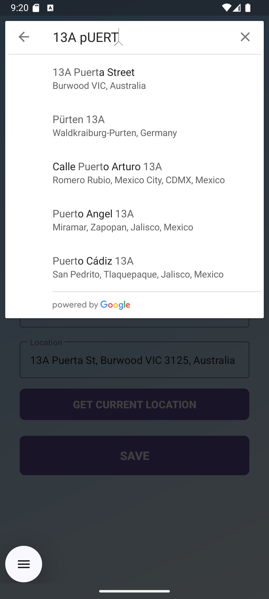

# Lost & Found Map App 📱


A comprehensive Android application for managing lost and found items, featuring location-based services and interactive maps to help users reconnect with their lost items.

## Features ✨

- **Create Lost/Found Adverts** with precise location data
- **Interactive Maps** to visualize item locations
- **Location Autocomplete** powered by Google Places API
- **Current Location Detection** for quick posting
- **List View** of all lost and found items
- **Item Details** with location information
- **Color-Coded Markers** (orange for lost, green for found items)

## Screenshots 📸

| Main Screen | Create Advert | Items List | Item Detail |
|-------------|---------------|------------|-------------|
|  |  |  |  |

| Map View | Location Selection | Item on Map |
|----------|-------------------|-------------|
|  |  |  |

## Technical Implementation ⚙️

### Architecture
- **Activity-based** navigation
- **SQLite Database** for data persistence
- **Google Maps Integration** for location visualization
- **Google Places API** for location autocomplete

### Components
- `MainActivity` - App entry point with main options
- `CreateAdvertActivity` - Form for adding new items
- `ItemsListActivity` - View all posted items
- `ItemDetailActivity` - Detailed view of a specific item
- `MapActivity` - Map visualization of items
- `DatabaseHelper` - SQLite database operations

### Location Features
- Google Maps integration for displaying items
- Location selection using Places API autocomplete
- Current location detection with the Fused Location Provider
- Geocoding for converting coordinates to addresses

### Data Model
- `Item` class with properties for type (lost/found), item details, and geographic coordinates

## Setup 🛠️

1. Clone the repository:
  ```bash
  git clone https://github.com/yourusername/lost-and-found-app.git
